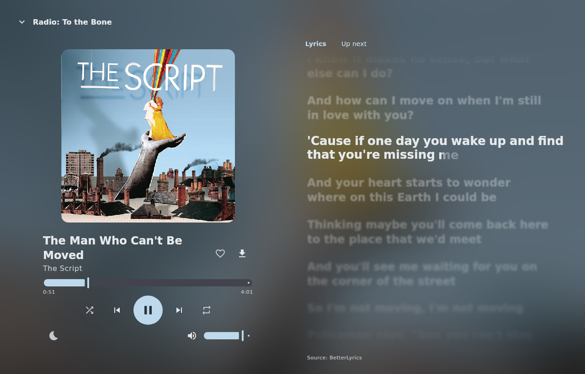
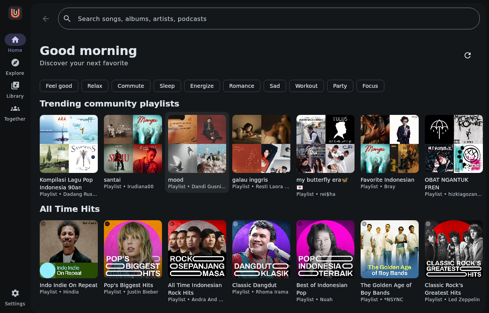
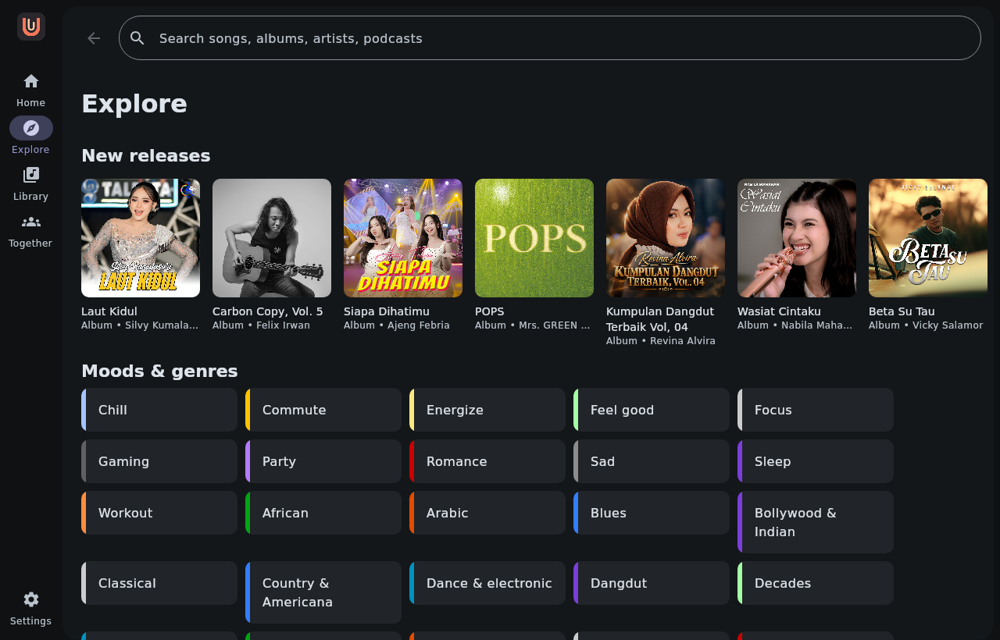
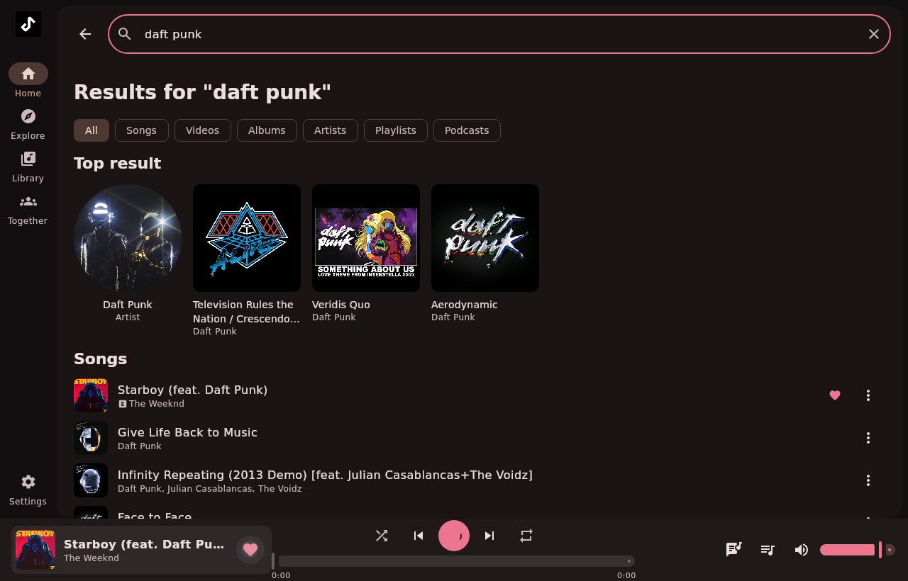
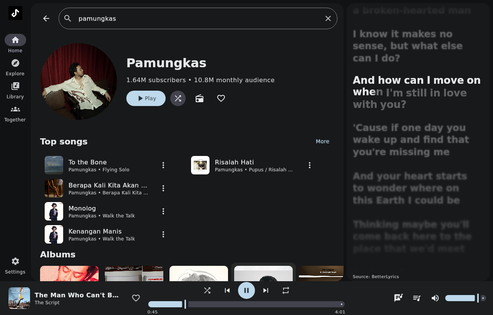
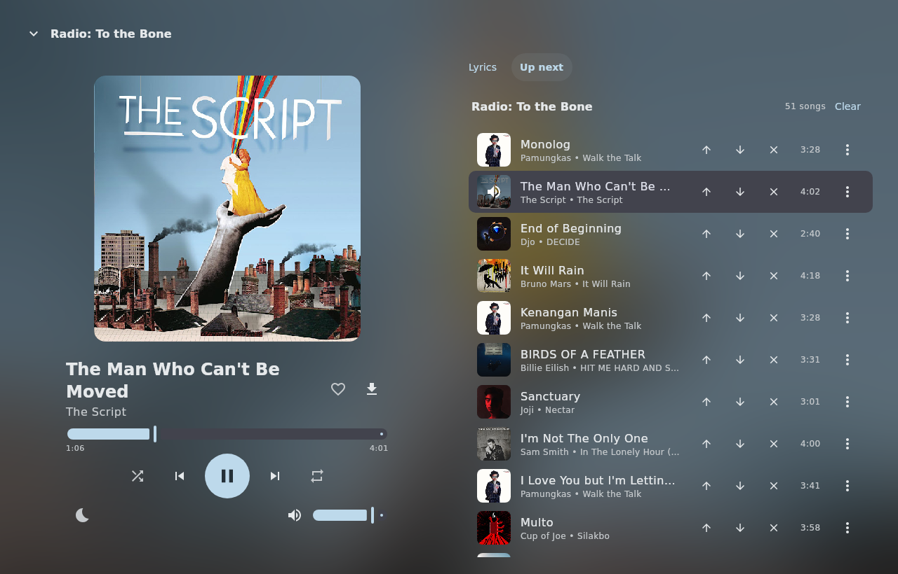

# Utaloom

YouTube Music client for **Android, Linux and Windows**.
Built with Kotlin and Compose Multiplatform (Material 3), with Media3 on Android and libVLC on desktop.

All platforms compile the same Utaloom UI, library, extraction, lyrics and Listen Together sources. Android adds only native playback, service, storage and document-picker adapters. No separate Metrolist application is vendored here.

## Screenshots



| Home | Explore |
| --- | --- |
|  |  |
| **Search** | **Artist page with lyrics panel** |
|  |  |
| **Up next queue** | |
|  | |

## Features

- Home feed, Explore (new releases, moods & genres, charts), search with suggestions and filters
- Albums, artists, playlists, podcasts, "Listen again"
- Player with queue, shuffle, repeat, radio (endless autoplay), sleep timer, volume normalization
- Synced lyrics with word-by-word (karaoke) highlighting. Providers: BetterLyrics, LrcLib, KuGou, Paxsenix, LyricsPlus (off by default), Zemer, YouTube subtitles, YouTube Music. They are tried in order with fallback, and you can reorder or toggle them in Settings → Lyrics providers
- Library: liked songs, history, local playlists, saved albums/artists/playlists
- Optional YouTube account login (cookie) to see your own library and recommendations
- Downloads for offline playback
- **Listen Together**: listen in sync with friends in a shared room
- Dynamic theme from album art, light/dark mode
- System tray, media keys, keyboard shortcuts, MPRIS on Linux (desktop media controls)
- Android: phone navigation, touch menus, background audio and notification/headset controls

## Install

### Requirements

Android requires **Android 8.0 or newer** and uses Media3, with no VLC or Java download. Desktop uses **libVLC**, supplied by the installer/package manager:

| Package | VLC |
|---------|-----|
| Windows `.msi` | Bundled inside the installer |
| `.deb` (Debian/Ubuntu) | Pulled in automatically by `sudo apt install ./utaloom_*.deb` |
| `.rpm` (Fedora) | Pulled in automatically by `sudo dnf install ./utaloom-*.rpm` (needs [RPM Fusion](https://rpmfusion.org/Configuration) for some codecs) |
| Other / run from source | Install VLC (`sudo pacman -S vlc`, etc.) |

If VLC is installed somewhere unusual, set `VLC_PATH` to the folder that contains `libvlc`.

### Download

Grab the latest build from [Releases](../../releases) or the [Actions](../../actions) artifacts:

- **Windows**: `utaloom-x.y.z.msi`
- **Android**: `utaloom-vx.y.z-android.apk`. Allow installation from the browser/file manager when Android asks. It installs as **Utaloom** (`com.utaloom.android`), separately from an existing Metrolist installation.
- **Debian/Ubuntu**: `utaloom_x.y.z_amd64.deb` (`sudo apt install ./utaloom_*.deb`)
- **Other Linux**: the portable app folder, run `bin/utaloom`

Desktop packages bundle their own Java runtime. Android release APKs are signed, and future versions use the same signing key.

## Keyboard shortcuts

| Keys | Action |
|------|--------|
| Ctrl + Space | Play / pause |
| Ctrl + → / ← | Next / previous |
| Ctrl + ↑ / ↓ | Volume up / down |
| Ctrl + L | Like current song |
| Alt + ← | Back |
| Media keys | Play/pause, next, previous |

## Listen Together

Open **Together**, enter a username, then **Create room** and share the code, or **Join room** with a friend's code.
Everyone in a room must use the same server.

The default server is `wss://utaloom.caliph.dev/ws`. You can change it in **Settings**.

## Signing in

Utaloom has no embedded browser, so sign-in uses your YouTube Music cookie:

1. Open https://music.youtube.com in your browser and sign in.
2. Open DevTools (F12) → Network, reload, click any request to `music.youtube.com`.
3. Copy the full `Cookie` request header.
4. Paste it in **Settings → Account**.

The cookie is stored only on your device and is **not encrypted**. On Android it is in app-private storage and excluded from backups. On Linux the settings file is owner-only. On Windows it inherits your user-profile folder permissions. Treat it like a password and never share `settings.json`.

## Data location

| OS | Folder |
|----|--------|
| Windows | `%APPDATA%\utaloom` |
| Linux | `~/.local/share/utaloom` |
| Android | App-private `files/utaloom` (no storage permission needed). Use the system document picker to import/export playlists. |

## Build from source

Requires JDK 21 and VLC 64-bit. Run the Windows installer tasks on Windows, with WiX Toolset 3 installed.

```bash
./gradlew :app:run                 # run
./gradlew :shared:jvmTest :app:test # parser, validation and codec tests
./gradlew :app:playerSmoke         # real native VLC paused-load/play/seek/pause check
./gradlew :app:networkSmoke        # live YouTube playback, download and offline playback check
./gradlew :app:lyricsProbe         # asks every lyrics provider for one song (live network)
./gradlew :app:ltProbe             # live host/guest check against configured test server
./gradlew :app:togetherAcceptance  # live desktop app ListenTogether + Player acceptance check
./gradlew :app:packageDeb          # Linux .deb
./gradlew :app:packageMsi          # Windows .msi (run on Windows)
./gradlew :app:createDistributable # portable app folder
```

On a drive without executable permissions, use `bash ./gradlew ...`. On Windows use `gradlew.bat ...` in PowerShell or Command Prompt.
For remote/headless Linux testing, run with `JAVA_TOOL_OPTIONS=-Dskiko.renderApi=SOFTWARE` under Xvfb.

Android uses the **same root Gradle wrapper**, JDK 21 and Android SDK 37 (target SDK 36). Set `ANDROID_HOME` or `sdk.dir` in an ignored `local.properties`:

```bash
bash gradlew :android:assembleDebug                  # signed, installable debug APK
bash gradlew :android:connectedDebugAndroidTest      # emulator/device: launch, queue, prebuffer, seek, media controls, background audio
bash gradlew :android:connectedDebugAndroidTest -Pandroid.testInstrumentationRunnerArguments.network=true # also live YouTube search/playback
```

The Android module is included for `:android:*` tasks or with `-Pandroid`, so desktop builders need no SDK. Release signing uses `UTALOOM_KEYSTORE` (file path), `UTALOOM_KEYSTORE_PASSWORD`, `UTALOOM_KEY_ALIAS` and `UTALOOM_KEY_PASSWORD` environment variables. GitHub Releases build and publish both the desktop installers and a signed APK from `appVersion`.

Project layout:

- `shared/` Kotlin Multiplatform logic (lyrics parsing, input validation)
- `innertube/` YouTube Music parsing/API module, with a JVM build and desktop logging shim
- `app/` shared Compose UI, queue/player logic, Listen Together, downloads and desktop host/adapters
- `android/` native Android host and adapters. Gradle generates a filtered view of the shared sources under `android/build/`, never a second checked-in app copy.

## Limitations

Not available on desktop yet: Google sign-in through a web page, account sync of likes/playlists back to YouTube, equalizer, crossfade, song recognition, widgets, Discord rich presence, Chromecast.

Some tracks may be unavailable because of YouTube client restrictions, regional rules or authentication requirements. Stream extraction uses direct URLs supported by VLC. It intentionally does not advertise SABR or bounded-range playback support. Downloads can use bounded ranges. The interface is currently English. Windows installers are unsigned, so SmartScreen may display a warning.

## Verification

Linux and Windows CI both run parser/input/codec tests plus native VLC paused buffering, play, seek and pause checks, then build their installers. Linux live checks also covered YouTube playback, downloading and offline playback. A separate two-client live check verifies room creation, join approval and playback messages on the default Listen Together server. Account login needs your own cookie and is not automatically exercised by CI.

## License

GPL-3.0. Not affiliated with Google or YouTube.

Parts of `innertube/` and the lyrics providers are derived from the GPL-3.0 project [Metrolist](https://github.com/MetrolistGroup/Metrolist) (credited as the license requires). Utaloom is an independent project and is not affiliated with or endorsed by Metrolist or its maintainers.
