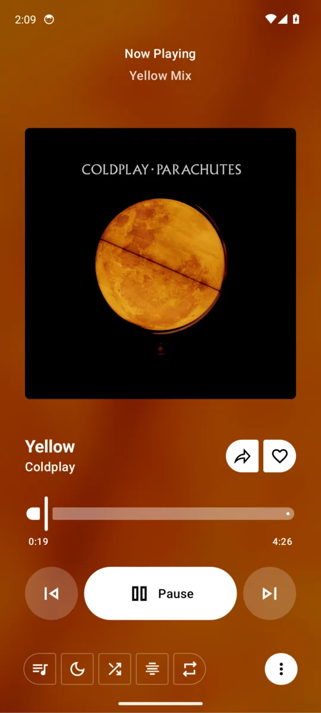
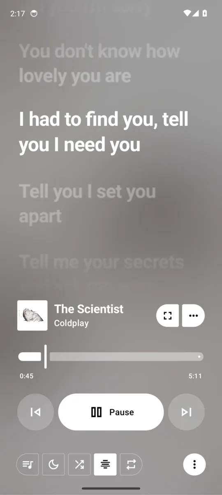

<div align="center">


# Metrolist · Caliph Edition

### An Apple Music styled fork of [Metrolist](https://github.com/MetrolistGroup/Metrolist), the YouTube Music client for Android

<br/>

[](https://github.com/cabrata/Metrolist/actions/workflows/caliph.yml)
[](https://github.com/cabrata/Metrolist/releases/tag/nightly)
[](LICENSE)

<br/>

[**Download**](#download) · [**What's different**](#whats-different) · [**Features**](#features) · [**Build**](#build) · [**Credits**](#credits)

</div>

> [!NOTE]
> This is an **unofficial fork**. It is not maintained by the Metrolist team. Please report bugs of this edition here, not upstream.
> Package name is `com.caliph.metrolist`, so it installs **alongside** the official Metrolist.

> [!WARNING]
> **Regional Restriction** - If YouTube Music is unavailable in your region, this app will not work without a **VPN or proxy** connecting to a supported region.

---

<div align="center">

<h1><a id="screenshots"></a>Screenshots</h1>






</div>

---

<div align="center">

<h1><a id="whats-different"></a>What's different from Metrolist</h1>

</div>

| | Metrolist | Caliph Edition |
|---|---|---|
| **Accent color** | Follows album art / wallpaper | Fixed Apple system blue `#0A84FF` |
| **Player background** | Solid by default | Animated artwork mesh, like Apple Music |
| **Lyrics** | Centered, Material style | Left aligned, Apple Music style word wipe, lift and glow |
| **Lyric depth** | Opacity only | Inactive lines shrink and blur by distance |
| **Interludes** | Wavy progress ring | Three breathing dots |
| **Tab bar & mini player** | Material 3 | Lightweight "liquid glass" look |
| **Package** | `com.metrolist.music` | `com.caliph.metrolist` |

All effects are tuned to stay light on battery:

- The background is a tiny 12px copy of the cover that gets upscaled, so it needs no heavy blur.
- It only animates at 30 fps, and only while music is playing.
- Blur effects run only on Android 12+. Older devices get the same look without the blur.

---

<div align="center">

<h1><a id="features"></a>Features</h1>

<table>
  <tr>
    <td width="50%" valign="top">

#### Playback
- Stream any song or video from YouTube Music
- Background playback
- Download & cache for offline use
- Skip silence, sleep timer

</td>
    <td width="50%" valign="top">

#### Audio
- Audio normalization
- Tempo & pitch control
- Equalizer
- Crossfade

</td>
  </tr>
  <tr>
    <td width="50%" valign="top">

#### Lyrics & Discovery
- Apple Music style synced lyrics with word-by-word highlighting
- AI-powered lyrics translation
- Personalized quick picks
- Search songs, albums, artists, videos, and playlists

</td>
    <td width="50%" valign="top">

#### Library & Account
- Full library management
- Local playlists, playlist import
- YouTube Music account login & sync

</td>
  </tr>
  <tr>
    <td width="50%" valign="top">

#### Social
- Listen together with friends in real-time
- Last.fm scrobbling
- Discord Rich Presence

</td>
    <td width="50%" valign="top">

#### Interface
- Apple Music inspired design in blue
- Light / Dark / Black theme modes
- Home screen widget

</td>
  </tr>
</table>

</div>

---

<div align="center">

<h1><a id="download"></a>Download</h1>

<a href="https://github.com/cabrata/Metrolist/releases/tag/nightly">
  
</a>

<h3>Every push to <code>main</code> is built by GitHub Actions and published to the <a href="https://github.com/cabrata/Metrolist/releases/tag/nightly">nightly</a> release.</h3>

</div>

---

<div align="center">

<h1><a id="build"></a>Build it yourself</h1>

</div>

Requires JDK 21 and the Android SDK.

```bash
./gradlew :app:assembleFossDebug
```

The APK is written to `app/build/outputs/apk/foss/debug/`.

---

<div align="center">

<h1><a id="credits"></a>Credits</h1>

<h3>All the hard work behind this app belongs to the <a href="https://github.com/MetrolistGroup/Metrolist">Metrolist</a> team and contributors. This fork only changes the look. Please support the original project.</h3>

<a href="https://github.com/MetrolistGroup/Metrolist/graphs/contributors">
  
</a>

</div>

---

<div align="center">

<h1>Special Thanks</h1>

<h3>Metrolist stands on the shoulders of incredible open-source work.</h3>

<h3>Main Inspirations</h3>

<table>
  <thead>
    <tr>
      <th align="center">Project</th>
      <th align="center">Authors</th>
    </tr>
  </thead>
  <tbody>
    <tr>
      <td align="center"><strong>InnerTune</strong></td>
      <td align="center"><a href="https://github.com/z-huang">Zion Huang</a> · <a href="https://github.com/Malopieds">Malopieds</a></td>
    </tr>
    <tr>
      <td align="center"><strong>OuterTune</strong></td>
      <td align="center"><a href="https://github.com/DD3Boh">Davide Garberi</a> · <a href="https://github.com/mikooomich">Michael Zh</a></td>
    </tr>
  </tbody>
</table>

<h3>Libraries & Integrations</h3>

<table>
  <thead>
    <tr>
      <th align="center">Project</th>
      <th align="center">Contribution</th>
    </tr>
  </thead>
  <tbody>
    <tr>
      <td align="center"><a href="https://better-lyrics.boidu.dev"><strong>Better Lyrics</strong></a></td>
      <td>Time-synced lyrics with word-by-word highlighting & YouTube Music integration</td>
    </tr>
    <tr>
      <td align="center"><a href="https://github.com/MetrolistGroup/metroserver"><strong>metroserver</strong></a></td>
      <td>Listen-together real-time backend</td>
    </tr>
    <tr>
      <td align="center"><a href="https://github.com/aleksey-saenko/MusicRecognizer"><strong>MusicRecognizer</strong></a></td>
      <td>Music recognition feature & Shazam API integration</td>
    </tr>
    <tr>
      <td align="center"><a href="https://github.com/ZemerTeam/zemer-cipher"><strong>zemer-cipher</strong></a></td>
      <td>YouTube cipher deobfuscation and PoToken generation</td>
    </tr>
  </tbody>
</table>


<h3>We also thank the entire open-source community! For every library, tool, and API that powers this project.</h3>

</div>

---

<div align="center">

<h1>Disclaimer</h1>

This project is **not affiliated with, funded, authorized, endorsed by, or in any way associated** with YouTube, Google LLC, Metrolist Group LLC, or any of their affiliates and subsidiaries.

All trademarks, service marks, and intellectual property rights referenced in this project belong to their respective owners.

</div>


---

<div align="center">

<br/>

**Original app by [Mo Agamy](https://github.com/mostafaalagamy) and the [Metrolist contributors](https://github.com/MetrolistGroup/Metrolist/graphs/contributors). Apple Music style edition by [cabrata](https://github.com/cabrata).**

**This project stands with Palestine 🇵🇸**

</div>
